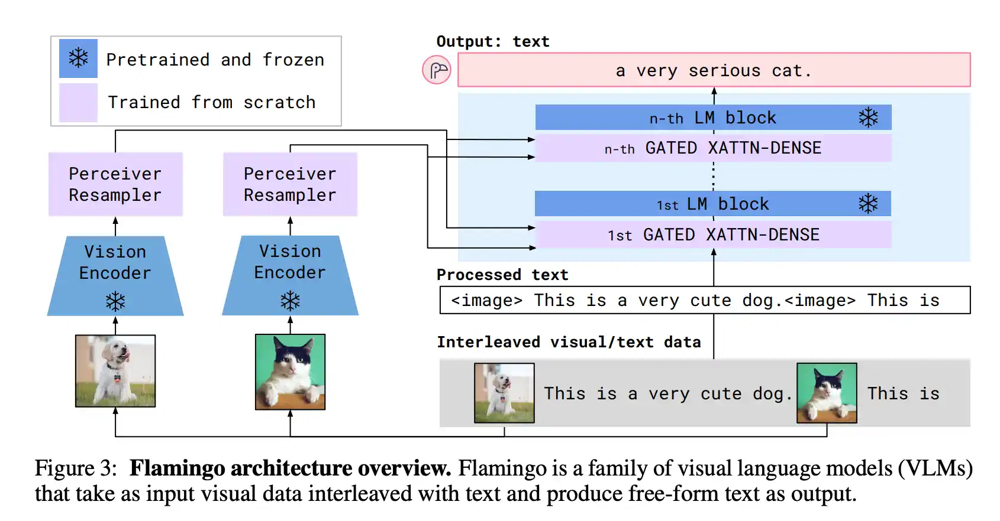
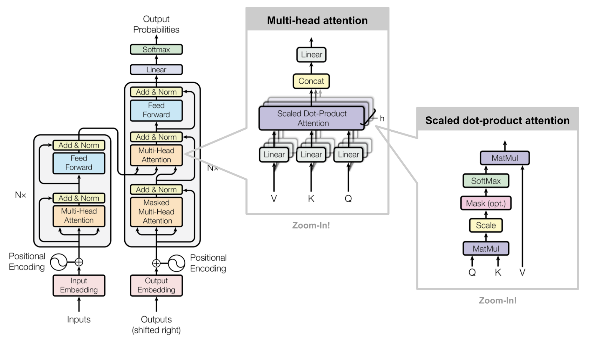

# 多模态大模型概述

多模态大模型是指能够处理多种数据模态（如文本、图像、音频等）的人工智能模型。它们在自然语言处理、计算机视觉等领域有广泛的应用。

## 1. 多模态大模型的特点

- 支持多种数据类型：
- 跨模态学习能力：
- 广泛的应用场景：
### 1.1 支持多种数据类型

多模态大模型能够同时处理文本、图像、音频等多种类型的数据，实现数据的融合。

## 2. 多模态模型架构

以下是多模态模型的典型架构示意图：

TransFormer 架构图：

### 2.1 模态融合技术

通过模态融合，可以提升模型对复杂数据的理解能力。

关键技术：注意力机制、Transformer架构等。

- 应用领域：
  - 自然语言处理：
    - 机器翻译、文本生成等。
  - 计算机视觉：
    - 图像识别、目标检测等。
## 3. 未来展望

多模态大模型将在人工智能领域持续发挥重要作用，推动技术创新。

